# Terminal Streaming Architecture

This document describes how terminal data flows from a tmux session on the Mac to both the local Mac mirror view and remote iOS devices. The architecture achieves low-latency mirroring with proper UTF-8 handling, data batching, and end-to-end encryption.

## High-Level Overview

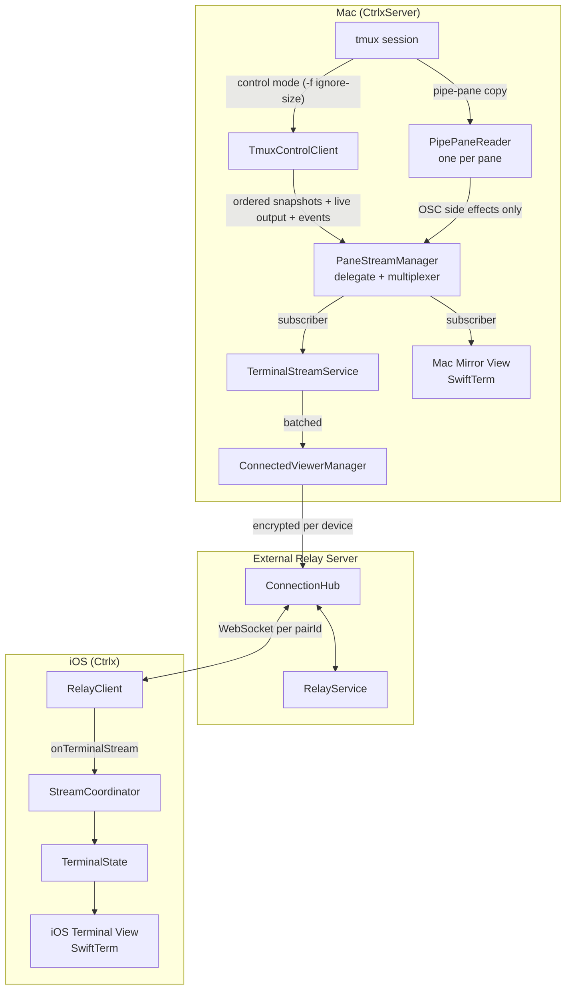

## Component Details

### 1. Tmux Data Capture (Mac)

The Mac app has one authoritative terminal-content path: tmux control mode carries both `capture-pane` responses and live `%output`. A separate persistent `pipe-pane` FIFO is scan-only and exists solely to extract OSC side effects such as notifications, titles, clipboard updates, and progress.

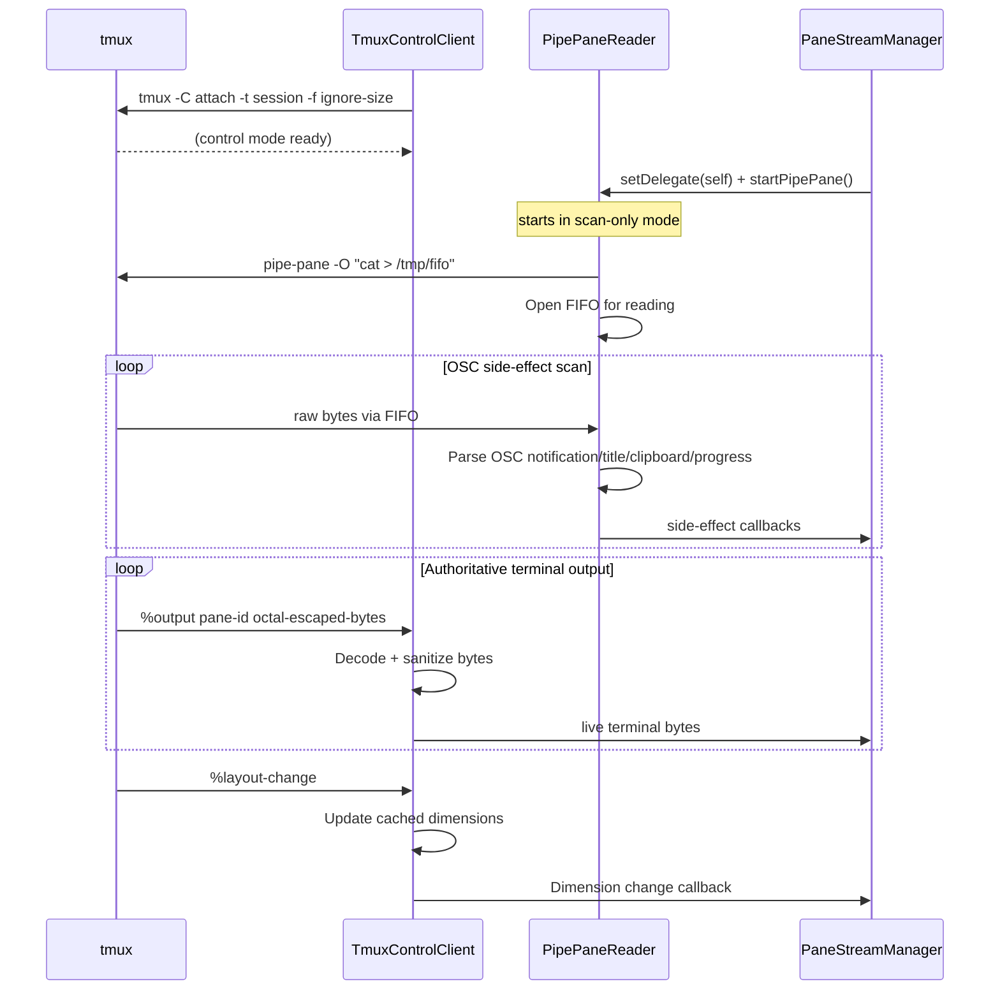

**Key Files:**
- `CtrlxServerFeature/Services/PipePaneReader.swift`
- `CtrlxServerFeature/Services/TmuxControlClient.swift`
- `CtrlxServerFeature/Services/TmuxService.swift`

**PipePaneReader** is an actor that:
- Manages a per-pane FIFO (`/tmp/ctrlx-pipe-<id>.fifo`) for scan-only OSC parsing. One reader instance per tmux pane lives for the pane's full lifetime
- Reads raw PTY bytes via `pipe-pane -O` piped through the FIFO
- Parses OSC 9/777/9;4/0/2/52 notification, title, clipboard, and progress events without rebuilding terminal data
- Uses AsyncStream + single consumer task for strict FIFO ordering of data chunks
- Forwards only side-effect events through `PipePaneReaderDelegate`; terminal bytes are always discarded

**TmuxControlClient** is an actor that:
- Maintains a long-lived `tmux -C attach -f ignore-size` process
- Handles individual commands via `sendCommand()` and snapshot transactions via `sendCommandList()`
- Parses event notifications (`%layout-change`, `%session-changed`, `%exit`)
- Decodes and sanitizes `%output` bytes for panes with active subscribers
- Captures history, visible cells and cursor in one non-blocking tmux command list; the boundary callback runs at its last `%end`, before parsing later `%output`
- Completes a command list early on `%error` (tmux skips its remaining commands); timed-out requests retain FIFO tombstones so late responses cannot complete a different request

`TmuxControlClientManager` coalesces concurrent connection creation per owning session. A stable pane target such as `%7` is **not** a session lookup key: subscription, capture and unsubscribe all use the reader's `sessionName`. An on-demand reader resolves the session from tmux before connecting. This prevents separate snapshot/output connections and leftover enabled sources when a pane is reopened.

### 2. Local Stream Management (Mac)

**PaneStreamManager** owns one scan-only `PipePaneReader` per known pane and multiplexes control-mode terminal output to subscribers. It conforms to `PipePaneReaderDelegate` only for OSC side effects.

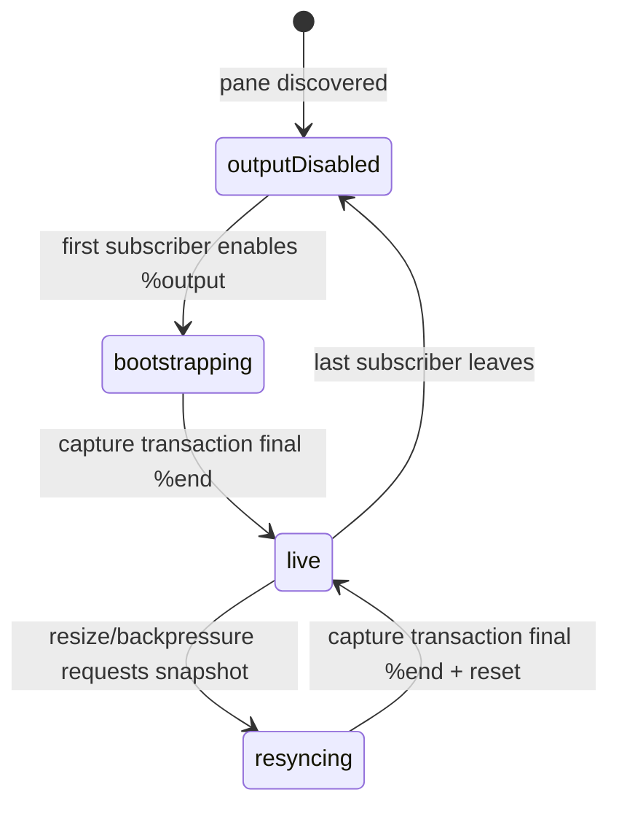

`subscribe(paneId:target:...)` follows the canonical sequence:

1. Register the subscriber's private bootstrap gate and enable `%output` for the pane.
2. Capture history, visible cells and cursor in one command-list transaction through that same session connection.
3. At the transaction's final `%end`, discard pre-boundary bytes already represented by the snapshot.
4. Return `snapshot + post-boundary bytes`, then route subsequent `%output` live.

When the last subscriber leaves, the manager disables `%output` for that pane. The FIFO remains attached in scan-only mode, so OSC side effects keep flowing for desktop notifications and sidebar UI.

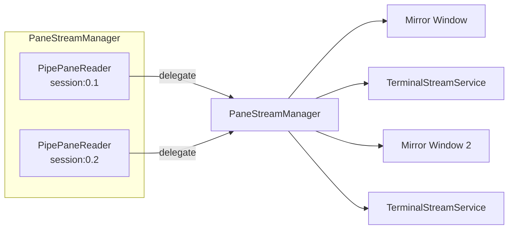

**Key Files:**
- `CtrlxServerFeature/Services/PaneStreamManager.swift`
- `CtrlxServerFeature/Services/PipePaneReader.swift`

Subscribers share a single reader. PaneStreamManager uses `TmuxControlClientManager` for commands (capture-pane, pipe-pane attach) and dimension tracking; per-pane state lives in a single `readers: [String: ReaderContext]` dictionary that records the reader, target, dimensions, subscriber set, and latest title.

### 3. Mac Mirror View

The local Mac mirror receives data through a PaneStreamManager subscription:

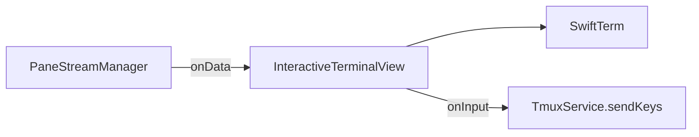

**Key File:** `CtrlxServerFeature/Views/InteractiveTerminalView.swift`

### 4. Remote Streaming (Mac → Server)

**TerminalStreamService** bridges local streams to the viewers that subscribed
to each pane via **ConnectedViewerManager**:

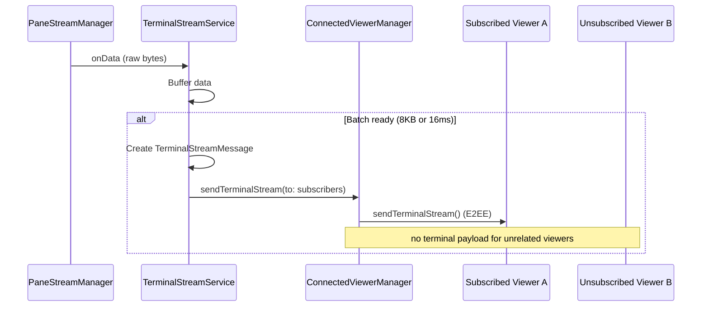

**Batching Strategy:**
- Maximum wait: 16ms fixed cadence (not trailing debounce)
- Maximum batch size: 8KB
- Prevents network saturation without starving a continuously updating TUI

**Multi-Viewer Ownership:**
- `TerminalStreamService` tracks an idempotent set of Viewer IDs per pane
- The first Viewer creates the PaneStreamManager subscription
- Additional Viewers reuse that stream and receive a private bootstrap snapshot
- The second-Viewer snapshot boundary is an ordered ingress control event: preceding queued bytes are discarded for that Viewer and following bytes are retained
- Bootstrap data is drained before `StartTerminalStream` returns success
- Live chunks and terminal control events are sent only to ready subscribers; a joining Viewer cannot refresh others or receive pre-initial updates
- `stopStreaming()` removes one owner; the stream stops when the set becomes empty
- System-level cleanups (`stopAllStreams`, `stopStreamsForClosedPanes`) use `force: true`

**Message Types:**
```swift
enum StreamUpdateType {
    case initialState(InitialState)     // Full buffer on stream start
    case dataChunk(DataChunk)           // Incremental updates
    case dimensionChange(DimensionChange) // Terminal resized
    case streamEnd                       // Stream closed
}
```

**Key Files:**
- `CtrlxServerFeature/Services/TerminalStreamService.swift`
- `CtrlxServerFeature/Services/ConnectedViewerManager.swift`
- `CtrlxServerFeature/Services/DeviceConnection.swift`

### 5. External Relay Server

The Vapor server routes messages between paired Mac and iOS devices. Each pairing (pairId) represents one Mac-iOS device pair. A Mac can have multiple pairings (one per iOS device), and each pairing has its own WebSocket connection.

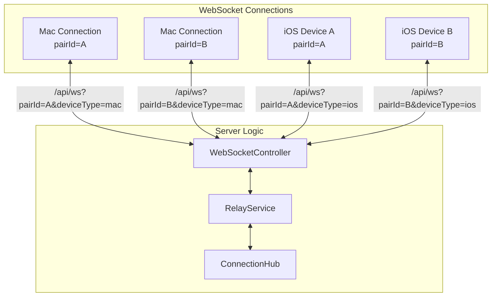

**ConnectionHub** maintains the connection registry:

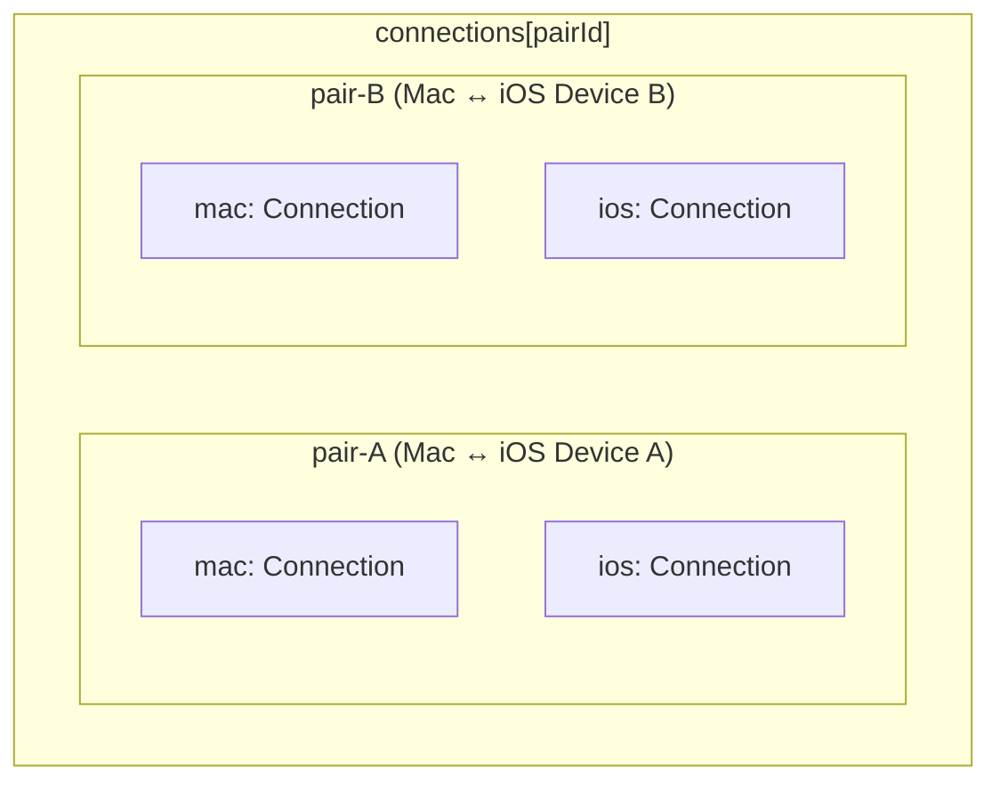

**Message Routing:**

1. Mac's `ConnectedViewerManager` sends encrypted terminal data per subscribed Viewer
2. Each `DeviceConnection` sends via its own WebSocket (unique pairId)
3. Synchronous WebSocket handlers append text and binary to one bounded `RelayInboundQueue` per connection
4. After pair/entitlement validation, one worker awaits each full `RelayService` forward in FIFO order
5. `ConnectionHub` rechecks source ownership and forwards original ciphertext to the paired Mac/iOS Viewer
6. Server cannot decrypt—true end-to-end encryption

Do not use WebSocketKit's async per-message callback overload here: it starts
independent Tasks and can reorder frames even though WebSocket itself is ordered.
The queue retains a 1 MiB pre-validation limit and bounds live backlog to 1024
frames / 8 MiB, plus one validation event and at most one in-flight frame. Close/replacement discards the
backlog; overflow closes the socket so clients resynchronize instead of continuing
with missing terminal bytes. See the 3.0.25 regression in
[terminal rendering investigation](terminal-rendering-investigation.md).

**Key Files:**

- `CtrlxExternalServerLib/Routes/WebSocketController.swift`
- `CtrlxExternalServerLib/Services/RelayInboundQueue.swift`
- `CtrlxExternalServerLib/Services/RelayService.swift`
- `CtrlxExternalServerLib/Services/ConnectionHub.swift`

### 6. iOS Reception

**RelayClient** receives WebSocket messages and decrypts them:

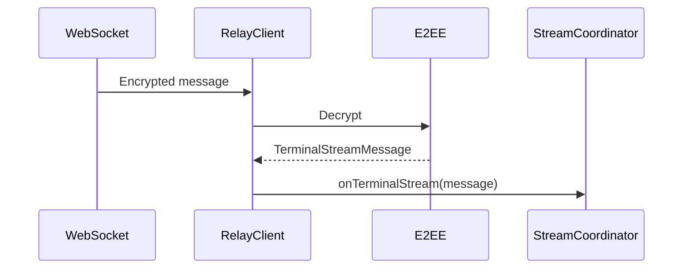

**Key File:** `CtrlxFeature/Services/RelayClient.swift`

### 7. iOS Display

**StreamCoordinator** manages the streaming session state:

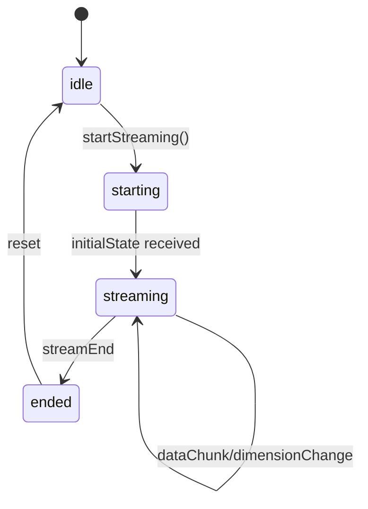

**Data flow to terminal:**

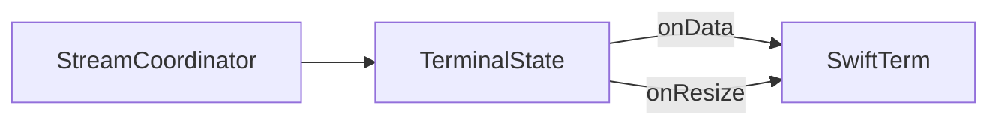

**Key Files:**
- `CtrlxFeature/Views/LiveTerminalView.swift`
- `CtrlxFeature/Views/TerminalStreamContainerView.swift`

### 8. Connection Liveness & Reconnection

A network switch (Wi-Fi↔Wi-Fi, Wi-Fi↔cellular, VPN toggle) leaves a
`URLSessionWebSocketTask` **half-open**: the old TCP connection is dead but
neither `send()` nor a blocked `receive()` errors promptly. Two mechanisms keep
this from turning into a stuck "green dot but nothing flows" state (issue #642):

**Client-side liveness watchdog** — `ViewerRelayClient` (viewer) and
`ConnectedViewer` (host) run a keep-alive ping loop that now *verifies* a reply.
Each cycle sets an `awaitingPong` flag before sending `.ping`; **any** inbound
frame (the `.pong`, terminal data, session state…) clears it. If the flag is
still set after the pong timeout, the socket is treated as half-open and
`cancel()`led, which makes `receiveMessages()` observe the failure and run the
normal disconnection → exponential-backoff reconnection path exactly once.
Without this, a half-open socket stays `.connected` indefinitely and only
`receive()` erroring (which a network switch does not reliably cause) or an app
restart would recover it.

**Server-side identity-aware unregister** — when a device reconnects it opens a
*new* socket that replaces the old entry in `ConnectionHub` (keyed by
`(pairId, deviceType)`). The old half-open socket's `onClose` can fire
seconds-to-minutes later. `ConnectionHub.unregisterIfCurrent(...)` only removes
the entry (and only then notifies the peer of a disconnect) when the closing
socket is *still the registered one*, so a stale close — or a `send` that fails
on a socket that was concurrently replaced — is a no-op. This prevents a late
close from evicting the live replacement and falsely flipping the peer's
`isViewerConnected`/`isHostConnected` to false. That flag gates
`pushSessionState()` (but not `sendTerminalStream()`), so the bug it caused was
specifically "live terminal keeps streaming, but new-session/new-tab/switch-window
updates never reach the viewer."

> **Server-initiated teardown must notify the peer itself.** `notifyConnection`
> for a disconnect fires from `WebSocketController`'s connection-worker cleanup
> (`onClose` stops that worker). A server-initiated teardown — the E2E `blockDevice` /
> `disconnectDevice` helpers, which close the socket *and* remove the
> `ConnectionHub` entry directly (so `isViewerConnected` / `isHostConnected` flip
> to false immediately) — makes that later `onClose` a deliberate no-op under
> `unregisterIfCurrent`, since the entry is already gone. So those helpers take
> the pair IDs returned by `disconnectAll(deviceType:)` and drive
> `notifyConnection(..., connected: false)` themselves; otherwise a viewer whose
> host was disconnected would never learn to clear its sessions (regression that
> surfaced in the *Host Disconnect Clears Sessions* E2E scenario).

## Complete Data Flow

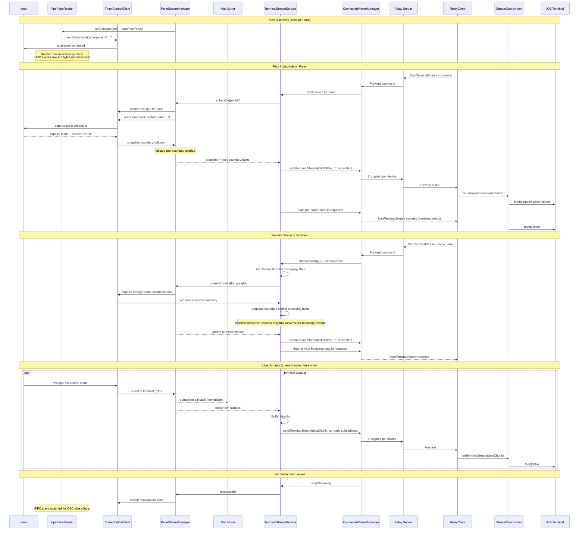

## Key Architectural Decisions

| Decision | Rationale |
|----------|-----------|
| **Single ordered terminal source** | Snapshots and live `%output` share one control stream, providing an exact boundary and preventing gaps or duplicated non-idempotent terminal sequences |
| **Scan-only pipe-pane** | Per-pane FIFO parses OSC side effects independently but can never feed terminal content, so it cannot race the authoritative control stream |
| **AsyncStream ordering** | Single consumer task per data source (PipePaneReader, TmuxControlClient, TerminalStreamService) prevents reordering that occurs with unstructured `Task {}` per callback |
| **One persistent OSC reader per pane** | PipePaneReader is created at pane discovery and lives until pane removal; mirror toggling never detaches it, preserving notification/title/progress parsing |
| **Boundary-aware bootstrap** | Per-subscriber gates discard `%output` before the visible capture's `%end`, retain output after it, and publish `snapshot + retained suffix` atomically |
| **Stream manager decoupling** | Streaming works without mirror window open, only needs iOS connection |
| **Data batching (8KB/16ms)** | Bounds latency without saturating the relay |
| **Subscription model** | Multiple consumers (UI + remote) share one stream efficiently |
| **Multi-device ref counting** | Multiple iOS devices watch the same pane without interfering; iOS ignores duplicate `initialState` when already streaming |
| **Per-device E2EE** | Each DeviceConnection has its own E2EE session; server cannot decrypt |
| **Session ID validation** | Prevents stale callbacks from old sessions affecting new ones |
| **Fail-closed E2EE** | Refuses to send sensitive data if encryption session not established |
| **Ping/pong liveness watchdog** | Verifies keep-alive pongs so a half-open socket after a network switch is detected and reconnected within one ping cycle instead of staying `.connected` forever (§8) |
| **Identity-aware unregister** | The relay only unregisters a connection when the closing socket is still the registered one, so a stale socket's late close can't evict the reconnected replacement (§8) |

## Key Types Reference

| Type | Location | Purpose |
|------|----------|---------|
| `PipePaneReader` | ServerFeature | Persistent per-pane FIFO scanner for OSC side effects only |
| `PipePaneReaderDelegate` | ServerFeature | `@MainActor` protocol for receiving OSC side effects from a reader |
| `TmuxControlClient` | ServerFeature | Ordered control connection for commands, snapshots, live output, and events |
| `PaneStreamManager` | ServerFeature | Owns one reader per pane, conforms to `PipePaneReaderDelegate`, multiplexes events to subscribers |
| `TerminalStreamService` | ServerFeature | Batches and sends to remote, ref-counted per device |
| `ConnectedViewerManager` | ServerFeature | Multi-Viewer WebSocket coordinator |
| `DeviceConnection` | ServerFeature | Single iOS device WebSocket + E2EE |
| `ConnectionHub` | ExternalServer | Server-side routing |
| `RelayService` | ExternalServer | Message handling |
| `RelayClient` | Feature (iOS) | iOS WebSocket client |
| `StreamCoordinator` | Feature (iOS) | iOS streaming state |
| `TerminalState` | Feature (iOS) | Bridge to SwiftTerm |
| `TerminalStreamMessage` | Networking | Shared message model |
